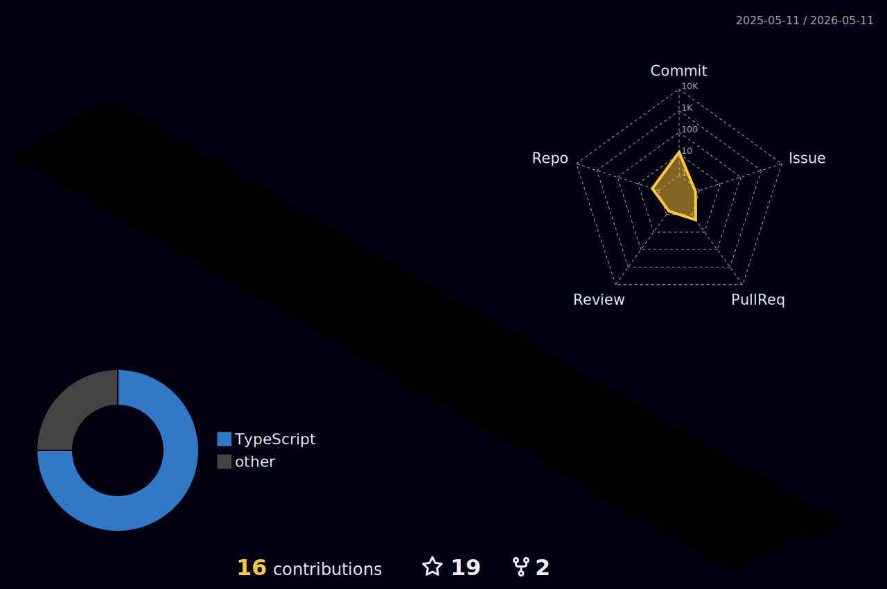

---

# 👋 About Me

- 💼 Backend Engineer Intern at **eInfochips (An Arrow Company)**
- 🌱 Currently working on **Microservices, Cloud-Native Systems & System Design**
- ⚙️ Focused on building scalable and efficient backend applications
- 💬 Ask me about **Java, Spring Boot, Docker & MERN**

---

# 🌐 Connect With Me

---

# ⚒️ Tech Stack

### Languages

### Backend

### Frontend

### Databases

### DevOps & Tools

---

# 📈 Contributions

---

