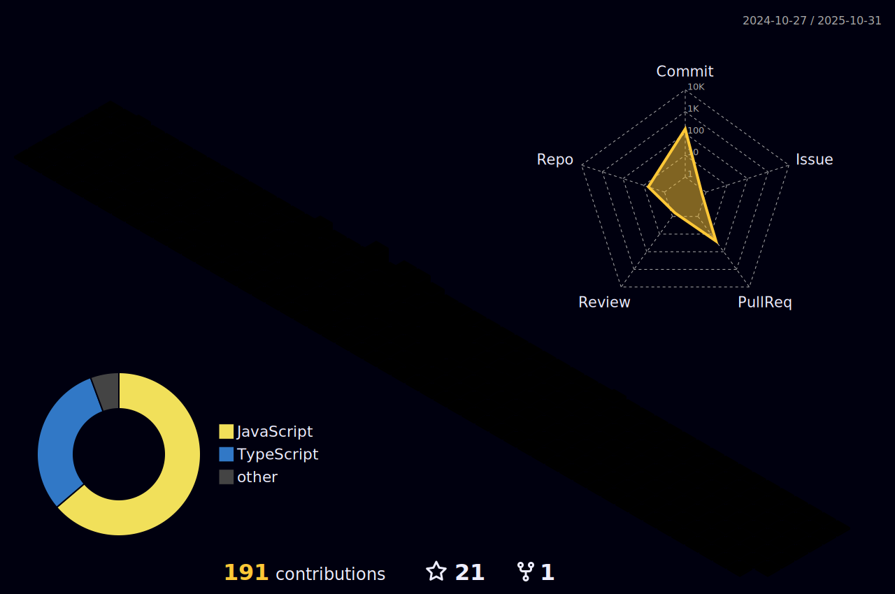

🌱 I’m currently learning <strong>Microservices</strong> 
💬 Ask me about <strong>Java, Spring Boot,</strong> and the <strong>MERN Stack</strong> 
🌐 To know more, visit my <a href="https://shailyfadadu.vercel.app/">Portfolio</a>

<!-- Add a unique and fun animation or GIF 

 -->

<h2>Let's Connect</h2>

  
  
  

<h2>Languages and Tools</h2>

<table align="center">
  <tr>
     <td align="center" width="90">
    
       JAVA
    </td>
    <td align="center" width="90">
      
       Spring-boot
    </td>
    <td align="center" width="90">
    
       Javascript
    </td>
    <td align="center" width="90">
    
       NodeJS
    </td>
     <td align="center" width="90">
    
       React
    </td>
    <td align="center" width="90">
      
       Next.js
    </td>
     <td align="center" width="90">
      
       Express.js
    </td>
    <td align="center" width="90">
      
       C++
    </td>

   </tr> 
   <tr>
     </td>
     <td align="center" width="90">
      
       Tailwind
    </td>
     <td align="center" width="90">
      
       MongoDB
    </td>
     <td align="center" width="90">
      
       MySQL
    </td>
     <td align="center" width="90">
      
       Vercel
    </td>
     <td align="center" width="90">
    
       Git
    </td>
    <td align="center" width="90">
    
       Postman
    </td>
     <td align="center" width="90">
    
       Docker
    </td>
    <td align="center" width="90">
    
       Intellij
    </td>
   </tr>
    
    
</table>

<h2> Github Stats</h2>

    

<h2>Contributions</h2>

  

